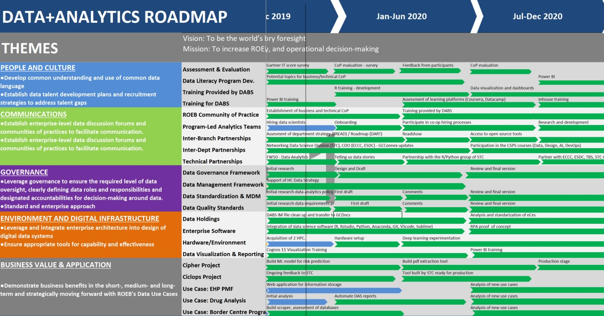

```{r setup, include=FALSE}
knitr::opts_chunk$set(echo = FALSE)
# rmarkdown::run("my_press", shiny_args = list(host="0.0.0.0", port=1234))
```


## DABS Organization FY2019-2020

- In the FY2019-2020, DABS experienced a high turnover. At the same time in order to support the pillars of the new Health Canada Data Strategy, DABS also welcomed new analysts with a background in data science, machine learning and project management. 


```{r echo = FALSE}
library(shiny)
library(timevis)

# - San Nguyen (previous manager) was on leave from April 9th to June 7th. Until October 28th, Peter was the manager of Remic Rapids Innovation and DABS.
# 
# - At the end of the fiscal year, DABS will have 2 students (Grace and Jesse), 2 contract employees (Omar and Jonathan), Dragana and Manolo.


data <- data.frame(
   id      = 1:8,
  content = c("Chieu, Malek(ST), Dragana, Peter(acting lead)"  , 
              "Chieu leaves (3)",
              "Malek(ST) leaves (2)", 
              "Omar joins (3)", 
              "Manolo joins (3)", 
              "Grace(ST) joins (4)",
              "Jesse(ST) joins (5)",
              "Jonathan joins (6)"),
  start   = c("2019-01-04", "2019-06-28", "2019-07-24", "2019-09-24", "2019-10-27", "2020-01-06", "2020-01-13", "2020-02-12"),
  end     = c("2019-06-28", NA, NA, NA, NA, NA, NA, NA)
)

ui <- fluidPage(
  timevisOutput("timeline")
)

server <- function(input, output, session) {
  output$timeline <- renderTimevis({
    timevis(data)
  })
}

shinyApp(ui = ui, server = server)
```

## Ongoing Initiatives and Current Projects

```{r cars, echo = FALSE}

library(networkD3)

name <- c("DABS", 
          "People and Culture", "CoP", "Business", "Power BI", "Shiny Dashboards", "Technical", "R", "Python",
          "Business Value and Application", "Use Cases", 
            "EHP Performance Measurement Framework", "Understand Business", "Build Application",
            "Border Center Program", "Initial Meeting", "Map dashboard",
            "DAS", "Innitial meeting", "Automate reports", "Dashboard for analysis",
            "Web Scraping: Tobacco, Vaping",
            "Support Remic Rapid Innovation",
            "Cipher", "Develop ML model", "Develop web application for prediction",
            "Cyclops", "Provided advice", "Github repo for project tracking",
          "Governance", 
            "HC Data Strategy",
            "Garner IT Score",
          "Environment and Digital Infrastructure",
            "Acquisition of HPC for image processing and DL",
            "Data Science Software at HC",
            "SAS 9.4 migration",
          "Communications",
            "Hiring",
              "Data Scientist with experience in DL",
              "2 students",
            "DASR updates",
            "DABS outlook updates",
            "Conferences",
              "Open House Data Literacy",
              "Forward 50",
              "Data and Big Day",
            "HR-Implementation of new SOMC for DS"
          )

group <- c(0, rep(1, 8), rep(2, 20), rep(3,3), rep(4, 4), rep(5,11))
group <-as.character(group)
id <- c(0:46)

nodes <- data.frame(name, group,id)
# write.csv(Nodes, "C:/Users/MMALAVER/Documents/r_code/presentation_D/nodes.csv")


source<- c(rep(0, 5), 1, rep(2,2), 3, 3, 6,6,#pc
           rep(9, 3), rep(10, 3), rep(11, 2), rep(14, 2), rep(17, 3), rep(22, 2),rep(23, 2),rep(26, 2),
           rep(29, 2),
           rep(32, 2),34,
           rep(36, 4), rep(37, 2),rep(42, 4))
target<- c(1, #Pc 
             9, #BV A
             29, #G 
             32, #EDI
             36, #C
           2,3,6,4,5,7,8, #pc
           10,21,22,11,14,17,12,13,15,16,18,19,20,23,26,24,25,27,28,
           30,31,
           33,34,35,
           37, 40,41,42, 38,39, c(43:46)
           )

links <- data.frame(source, target)


ColourScale <- 'd3.scaleOrdinal()
            .domain(["0","1","2","3","4","5"])
           .range(["#000000", "#2FA4C7", "#BFC2C0" , "#694489", "#FF6900",  "#1FC054"]);'

forceNetwork(Links = links, Nodes = nodes, 
             Source = "source",
             Target = "target",
             NodeID ="name",
             Group = "group",
             # Value = "width",
             opacity = 0.9,
             zoom = TRUE,
             colourScale = JS(ColourScale),
             fontSize = 40)
```

```{r , echo = FALSE}

## Milestones/Targets

# Q1: 	
# 
# - Share selection process criteria for hiring of data analysts.
# - Develop queries, datasets and quality reports to support POD-CRIU and HPIL to implement Cost Recovery.
# - Director-level D&A Committee launched. 
# 
# Q2: 
# 
# - Deliver intermediate analytics courses to the Community of Practice (CoP) (SQL, SAS, data literacy).
# - Share EC03/EC04 pool with programs.

# Q3:  
# 
# - Assess program specific data quality needs and issues to develop data quality framework.
# - Develop data management and governance framework.
# - Support programs to initiate data integration of high value C&E data.
# 
# Q4:
# 
# - Evaluate ROEB’s data literacy and develop the 2020-2021 learning plan.
# - Lead CoP engagement with D+A working groups  in partner branches and departments.
# - Obtain senior management approval for implementation of the data frameworks.
# - Leverage knowledge and lessons learned from Solution Fund (Cipher) and explore application of AI to support predictive analysis of risk and regulatory decisions.

```
## Current Work Q4

- Update of the DASR and DABS outlook.
- Linkage of the Gartner IT Score with the DASR. 
- Develop a survey to measure the level of knowledge of the CoP members. 
- DABS IM file clean up and transfer to GCDocs.
- Build a dashboard that showcases drugs statistics for the Drug Analysis Service program.  
- Automate the report generation in both official languages of the Drug Analysis Service program.

## Current Work Q4

- Continue to support the HC Data Strategy and the development of documentation to support Artificial Intelligence at the department level. 
- Prepare R/RStudio and PowerBI material to present in the technical and business CoP.
- Train and welcome 2 co-op junior data scientists and 1 data scientist.
- Participate in co-op hiring process for Spring/Summer 2020 term.
- Initial research for developing the data analytics policy and the data requirements policy.

 
## Deliverables for Next FY



## Deliverables for Next FY
- Provide R, Power BI, Python training through the CoP.
- Deliver a fully operational Machine Learning (ML) model and web application for the Cipher project.
- Continue implementation of business solutions for DAS, EHP, Border Centre Program, etc.
- Play an advisory role in ML and deep learning projects like Cyclops, Humming Bird, etc.
- Advise upper management and IMSD on the minimum data science software and hardware requirements that should be included in the departmental data science toolbox.
- Support the integration of the Data Strategy Framework by contributing to the development of data strategic road-maps (examples: DART, BREAD) which will showcase the importance of the use of HC data as an asset.  
- Build capacity by hiring data scientists with expertise in ML and software integration.

##Thank You

DABS team:

- Dragana Guibault (Business Analyst)
- Grace Wang (Junior Data Scientist - Student)
- Jesee Zheng (Junior Data Scientist - Student)
- Jonathan Blanchette (Data Scientist - Feb. 12th)
- Manolo Malaver-Vojvodic (Manager)
- Omar Ayad (Research Analyst)


